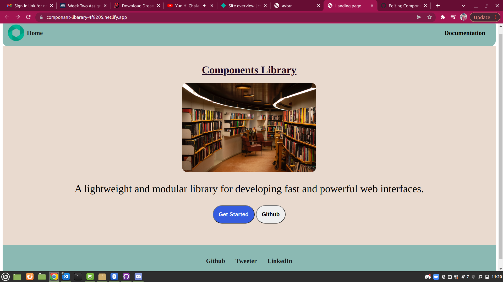

# Componant-library
This is a componant library which you will use in building your own web app very easily and morever it lets you copy entire layout from this componant to build your own desired website.

## Technologies Used :
- HTML
- CSS

# Home Page Preview :

## Available componants :
- [Avatar](https://componant-libarary-4f8205.netlify.app/avatar/avatar)
- [Alert](https://componant-libarary-4f8205.netlify.app/alert/alert) 
- [Badge](https://componant-libarary-4f8205.netlify.app/badges/badge)
- [Button](https://componant-libarary-4f8205.netlify.app/button/button)
- [Card](https://componant-libarary-4f8205.netlify.app/card/card)
- [Image](https://componant-libarary-4f8205.netlify.app/image./image.html)
- [Input](https://componant-libarary-4f8205.netlify.app/input/input)
- [Navigation](https://componant-libarary-4f8205.netlify.app/navigation/navigation)
- [Text-Utilities](https://componant-libarary-4f8205.netlify.app/text-utilities/text)
- [Rating](https://componant-libarary-4f8205.netlify.app/rating/rating)
- [Slider](https://componant-libarary-4f8205.netlify.app/slider/slider)

## Author: [Nikhil_Malviya](https://github.com/nikk422)
